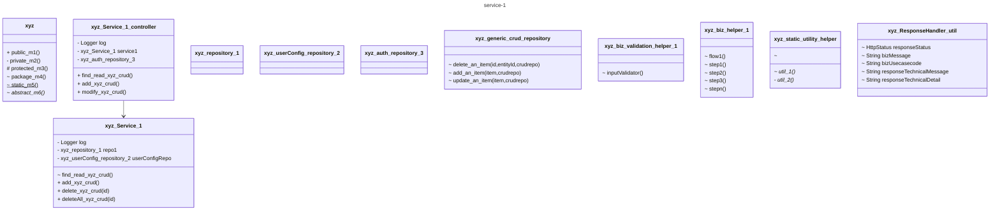
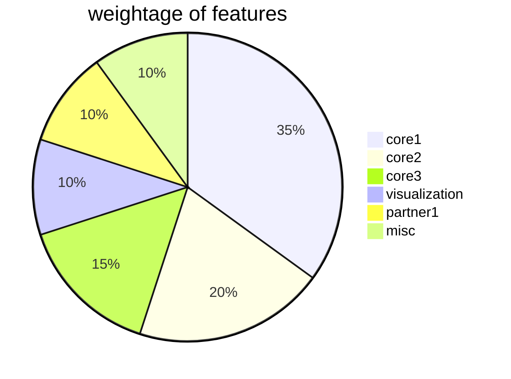
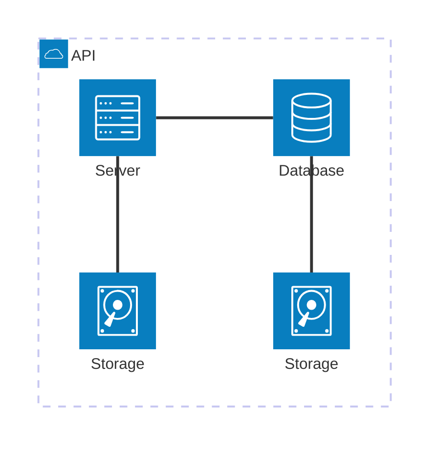

## Note: under construction


# stakeholders-1-business 
- closer to business, functional, PO, FO, BA

## flow charts
## excel-data 2d projections

# stakeholders-2-implementers 
-  developers, implementers, designers, architects

## state diagram
  
### typical-microservice-archtr : view-1 : structural : lowlevel



```mermaid
sequenceDiagram
    %% actor xyz userPerona
    actor @healthcare_worker 
    %% actor lay people
    %% actor ambulance dispatchers 
    %% actor community first reponder

    participant @Restcontroller
    participant @Service
    participant @Repository

    @healthcare_worker ->> @Restcontroller: froncontroller to receive biz request leveraging http request params
    @Restcontroller ->> @Service: delegate to service post authentication, authorization, some basic pre processing stuff
    @Service ->> @Repository: does a crud on datastore
    @Repository ->> @Service: hands over a response with success, failure
    @Service ->>  @Restcontroller: hands over response with a optional biz use case message, optionally could do a post processing activity
    @Restcontroller ->> @healthcare_worker: ideally, hands over back the useful response

```


## weightage: features 

- some dirty hack, to save time on visulizations, dynamcially the conent could be published to recepient, if browser this should do the job.


- [aws compute](https://aws.amazon.com/products/compute/?nc2=h_ql_prod_cp_com)
- https://aws-icons.com/
- [logos: aws-icons](https://iconduck.com/free-icons/logos)

```mermaid
architecture-beta
    group cloud(cloud)[deployment_options in cloud]

    service vm(logos:aws-ec2)[vm ec2] in cloud
    service vm_container(logos:aws-ecs)[container_ecs] in cloud 
    service vm_container_mgd(logos:aws-fargate)[container_mgd_ecs] in cloud 
    service vm_container_beanstalk(logos:aws-elastic-beanstalk)[mgd_cicd_beanstalk] in cloud 

    service vm_container_FAAS(logos:aws-lambda)[cloud_provider_mgd_FAAS] in cloud 

```

```mermaid
architecture-beta
    group cloud(cloud)[storage_options in cloud]

    service rowdb(logos:aws-aurora)[row by row rds] in cloud
    service columnardb(logos:aws-redshift)[columnar Store_redshift] in cloud 
    service objectStore(logos:aws-s3)[objectStore_s3] in cloud 

```

```mermaid
architecture-beta
    group faas(logos:aws-lambda)[deployment_1_faas]

    service database1id(database)[biz1 aurora rds] in faas
    service mybucket1(logos:aws-s3)[s1] in faas 

```

```mermaid
architecture-beta
    group vm_custom_mgd(logos:aws-ec2)[deployment_3_custom_vm]

    service database1id(database)[biz1 aurora rds] in vm_custom_mgd
    service mybucket1(logos:aws-s3)[s1] in vm_custom_mgd 

```










### glossary

## composition
- stronger form of association with ownership and life cycle dependence
## aggregation
- sum of part 1 .. n
## assoication
- one to one, one to many ,many to many